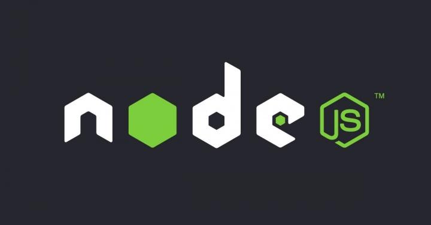

<h1 align="center">
  
</h1>

<h3 align="center">
  Gostack Challenge 01: Node.js concepts
</h3>

<blockquote align="center">“Your only limitation is yourself”!</blockquote>

<p align="center">
  

  
</p>

<p align="center">
  

  

  

  
</p>

<p align="center">
  <a href="#rocket-about-the-challenge">About the Challenge</a>&nbsp;&nbsp;&nbsp;
  |&nbsp;&nbsp;&nbsp;<a href="#electric_plug-how-to-use">How to Use</a>
  &nbsp;
  |&nbsp;&nbsp;&nbsp;<a href="#memo-license">License</a>
</p>

## :rocket: About the challenge

Create a `CRUD` application from scratch using good programming practices.

With this `CRUD` the following is possible:

- The creation of `Repositories`.

- Reading, updating and removing a specific `Repository`.

- The increment of `Likes` of a given` Repository.

### Routes

- `POST /repositories`: The route must receive `title`, `url` and `techs` within the body of the request, the `url` being the link to the github of this repository. When registering a new repository, it must be stored inside an object in the following format:

```js
{
  id: "uuid",
  title: 'Node.js Challenge',
  url: 'http://github.com/..',
  techs: ["Node.js", "..."],
  likes: 0
}
```

Make sure the `id` is a `UUID` and always `likes` tanned as 0.

- `GET /repositories`: Route that lists all repositories;

- `PUT /repositories/:id`: The route must change only the `title`, `url` and `techs` of the repository that has the `id` equal to the `id` present in the route parameters;

- `DELETE /repositories/:id`: The route must delete the repository with the `id` present in the route parameters;

- `POST /repositories/:id/like`: The route must increase the number of `likes` of the specific repository chosen through the id present in the route parameters, at each call of this route, the number of `likes` must be increased by 1;

### Testing Specification

In each test, you have a brief description of what the challenge must meet in order to pass the test.

The tests are the following tests:

- `Should be able to create a new repository`: For this test to pass, your application must allow a repository to be created, and return a json with the created project.

- `Should be able to list the repositories`: For this test to pass, your application must allow an array of all repositories that have been created to date to be returned.

- `Should be able to update repository`: For this test to pass, your application must allow only the url, title and techs fields to be changed.

- `Should not be able to update a repository that does not exist`: For this test to pass, you must validate in your update route whether the repository id sent by the url exists or not. If not, return an error with status 400.

- `Should not be able to update repository likes manually`: For this test to pass, you should not allow your update route to directly change the likes of that repository, maintaining the same number of likes that the repository already had before the update. That's because the only place that should update this information is the route responsible for increasing the number of likes.

- `Should be able to delete the repository`: In order for this test to pass, you must allow your delete route to delete a project, and when deleting it, it returns an empty response, with status 204.

- `Should not be able to delete a repository that does not exist`: In order for this test to pass, you must validate on your delete route whether the repository id sent by the url exists or not. If not, return an error with status 400.

- `Should be able to give a like to the repository`: For this test to pass, your application must allow a repository with the given id to receive likes. The value of likes must be increased by 1 with each request, and as a result, return a json containing the repository with the number of likes updated.

- `Should not be able to like a repository that does not exist`: In order for this test to pass, you must validate on your like route whether the repository id sent by the url exists or not. If not, return an error with status 400.

## :electric_plug: How to use

So when this project is cloned on your machine, it is necessary to install its modules using the package manager `YARN`...
If you do not have `YARN` properly installed on your machine, [access this link](https://yarnpkg.com/) to download and install...
If you already have `YARN` installed, open `terminal` (linux) or `cmd` (windows) at the root of the project where the `package.json` file is located and run the following command:

```
yarn
```

After that, `YARN` will install all the project dependencies for you...
The second and last step is to start the project, for this I have already prepared a command in the script of the file `package.json`, just just run the following command:

```
yarn dev
```

**Note:** To make your life easier I left a configuration for requests for all routes in the following path `temp\configs\Insomnia_2020-08-11.json`. To use this configuration, just import it into the software and if you don't have it [access this link](https://insomnia.rest/) to download and install it.

## :memo: License

This project is under the MIT license. See the [LICENSE](LICENSE) for more details..

---

Made with ♥ and the intention of learning through the bootcamp of [Rocketseat](https://rocketseat.com.br/) 👋
