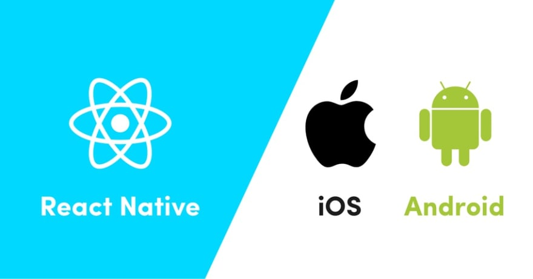

<h1 align="center">
  
</h1>

<h3 align="center">
  Gostack Challenge 03: React Native concepts
</h3>

<blockquote align="center">“Your only limitation is yourself”!</blockquote>

<p align="center">
  <a href="#rocket-about-the-challenge">About the Challenge</a>&nbsp;&nbsp;&nbsp;
  |&nbsp;&nbsp;&nbsp;<a href="#electric_plug-how-to-use">How to Use</a>
  &nbsp;
  |&nbsp;&nbsp;&nbsp;<a href="#memo-license">License</a>
</p>

## :rocket: About the challenge

In this challenge, you must create create an application mobile with _REACT NATIVE_ from scratch using good programming practices, in addition, _create communication with the repository backend_ created in [CHALLENGE 02](https://github.com/thiagobonisoficial/gostack-challenges/tree/master/challenge-01) _with Nodejs_.

In this challenge, the following topics were addressed:

- _Concepts_
- _Components_
- _Style Components_

### Application Features

- `List your API repositories`: You should be able to create a list of all repositories that are registered in your API with the title, techs and number of likes fields following the \$ {repository.likes} likes pattern, just changing the number to be dynamic.

- `Like a listed API repository:`: You should be able to like an item in your API through a button with the text Like and you must update the number of likes in the listing on the mobile.

### Testing Specification

In each test, you have a brief description of what the challenge must meet in order to pass the test.

The tests are the following tests:

- `Should add a like to the like counter of the repository`: For this test to pass, your application must allow by clicking on the Like button, a like to be added to the listed repository, and that this update can be viewed on the screen.

## :electric_plug: How to use

So when this project is cloned on your machine, it is necessary to install its modules using the package manager `YARN`...
If you do not have `YARN` properly installed on your machine, [access this link](https://yarnpkg.com/) to download and install...
If you already have `YARN` installed, open `terminal` (linux) or `cmd` (windows) at the root of the project where the `package.json` file is located and run the following command:

```
yarn
```

After that, `YARN` will install all the project dependencies for you...
The second and last step is to start the project, for this I have already prepared a command in the script of the file `package.json`, just just run the following command:

```
yarn start
```

```
yarn android
```

```
yarn ios
```

## :memo: License

This project is under the MIT license. See the [LICENSE](LICENSE) for more details..

---

Made with ♥ and the intention of learning through the bootcamp of [Rocketseat](https://rocketseat.com.br/) 👋
